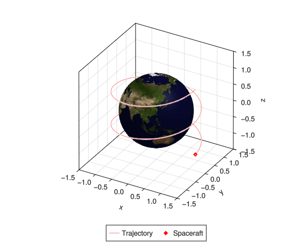

# PrettyTrajectory.jl
Trajectory plotting with the [Makie](https://docs.makie.org/v0.22/) ecosystem

## Quick start

### Development

1. `git clone` this repository
2. `cd` to root of repository & start julia repl
3. Run:

```julia-repl
julia> ]
(PrettyTrajectory) pkg> test
```

### Using `PrettyTrajectory` within your project

In julia repl, run

```julia-repl
(SomeEnvironment) pkg> dev https://github.com/Yuricst/PrettyTrajectory.jl.git
```

## Capabilities

- Plot planets/moons with UV sphere


## Examples

See [examples/examples.ipynb](examples/examples.ipynb) for examples & syntax!


## Gallery

Below are examples from `PrettyTrajectory` functions!

#### `plot_planet!`


#### `plot_cone!`


#### `plot_3d_box!`


#### `OrbitAnimator`




## Missing features (todo)

- Animation
    - [ ] Rotating planet
    - [x] Trajectory