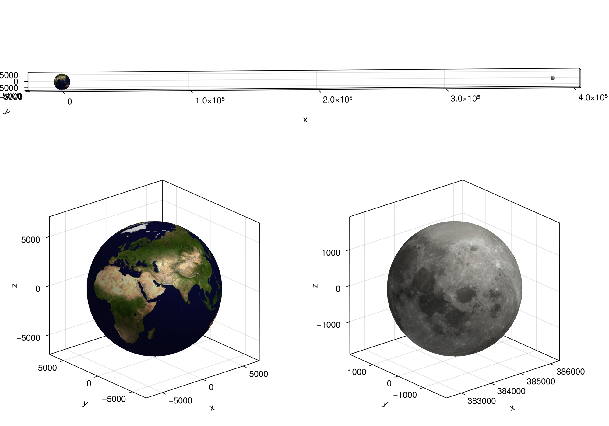

# PrettyTrajectory.jl
Trajectory plotting with Makie.jl ecosystem

## Quick-step

### Development

1. `git clone` this repository

## Capabilities

- Plot planets/moons with UV sphere

## Examples

See `examples/examples.ipnyb` for examples!

## Gallery

## Missing features (todo)

- Animation
    - [ ] Rotate planet
    - [ ] Trajectory